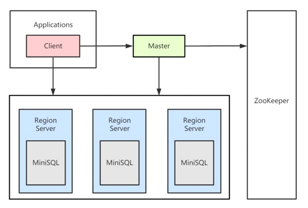
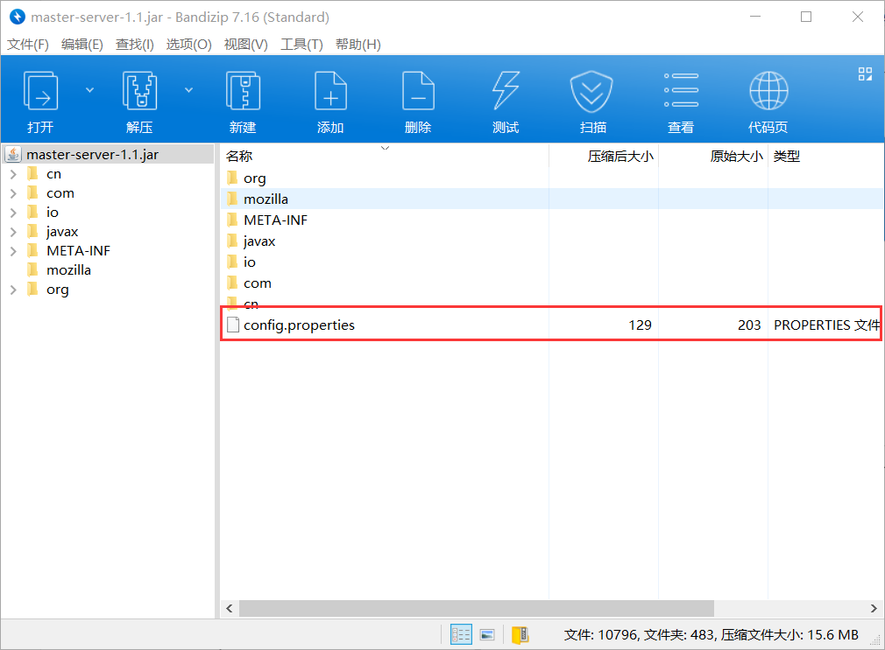

# Distributed MiniSQL

This is a simple distributed relational database implementation for ZJU course. It stores table data in multiple Region Servers, and replicates data when some Region Server crashes, which makes it a system with high availability. What's more, hash load balance and client cache is also applied to make it faster. Its architecture is shown in the following graph.



### Start

First, you have to download and run [ZooKeeper](https://www.apache.org/dyn/closer.lua/zookeeper/zookeeper-3.6.3/apache-zookeeper-3.6.3-bin.tar.gz). To start ZooKeeper you need a configuration file. Here is a sample, create it in `conf/zoo.cfg`.

```
tickTime=2000
dataDir=/var/lib/zookeeper
clientPort=2181
```

Now that you created the configuration file, you can start ZooKeeper. (On Windows, you can directly open `bin\zkServer.cmd`)

```shell
bin/zkServer.sh start
```

After that, you can connects to the ZooKeeper with ZooKeeper client. (On Windows, you can directly open `bin\zkCli.cmd`)

```shell
bin/zkCli.sh -server 127.0.0.1:2181
```

Then, input the following command in ZooKeeper client to create a persistent node, where Master Server listens to, to monitor the Region Servers.

```shell
create /region-server
```

Now, ZooKeeper configuration is completed, you can download jar packages in the latest [release](https://github.com/JouleYuan/DistributedMiniSQL/releases/tag/v1.1).

After that, you have to modify `config.properties` in the jar packages. 



After the configuration is done, you can input the following command to start the programs. Note that the Master Server should always be started first, otherwise, there might be unexpected errors in Region Servers.

- Start Master Server

  ```shell
  java -jar master-server-1.1.jar
  ```

- Start Region Server

  ```shell
  java -jar region-server-1.1.jar
  ```

- Start Client

  ```shell
  java -jar client-1.1.jar
  ```

### Usage

You can input SQL command in Client to manage this distributed database.

- Create table (Note that only tables with a primary key can be created)

  ```sql
  create table employee
  ( 
  id int ,
  name char(20) unique,
  age int ,
  salary float,
  primary key(id)
  );
  ```

- Drop table

  ```sql
  drop table employee;
  ```

- Create index

  ```sql
  create index name_index on employee(name);
  ```

- Drop index

  ```sql
  drop index name_index on employee;
  ```

- Insert record

  ```sql
  insert into employee values(2,'Kate',24,1800.00);
  ```

- Delete records

  ```sql
  delete from employee where salary<1900.00;
  ```

- Query records

  ```sql
  select * from employee where salary>=1900.00 order by age desc;
  ```

### Build

If you want to build this project yourself, you can run the following command to generate jar packages.

```shell
mvn clean pakcage
```

After the jar packages are built, manually add `config.properties` to the jar packages. Please notice that you should use the jar packages with dependencies.

